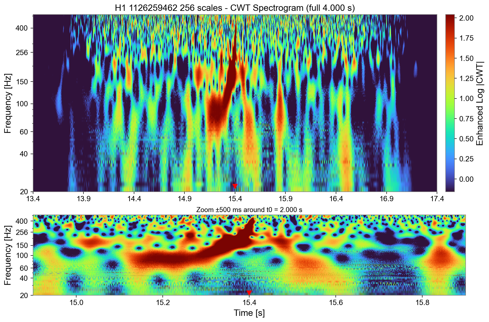

# CWT-LSTM Autoencoder for Gravitational Wave Detection


[](https://github.com/gravitational-wave-detection/cwt-lstm-ae-grav-wav)
[](https://www.python.org/downloads/)
[](LICENSE)
[](https://www.ligo.org/)
[](#results)

## Overview

An unsupervised anomaly detection system for identifying gravitational wave signals in LIGO detector noise using Continuous Wavelet Transform (CWT) and Long Short-Term Memory (LSTM) autoencoders. Trained on O4 (GWTC-4.0) data, achieving 97% precision and 96% recall on 126 confirmed events. 

## Key Features

- **Unsupervised Learning**: Trains exclusively on detector noise, requiring no labeled gravitational wave signals
- **CWT Preprocessing**: Continuous Wavelet Transform preserves both time and frequency information critical for gravitational wave detection
- **LSTM Architecture**: Captures temporal dependencies in detector noise patterns
- **Exceptional Performance**: 97% precision, 96% recall, ROC-AUC 0.994 on O4 test data
- **Single-Run Training**: Eliminates batch effects from cross-run calibration differences
- **Production Ready**: Comprehensive evaluation metrics, logging, and run management

## Results


📊 **[View Comprehensive Results & Analysis](analysis_results/COMPREHENSIVE_RESULTS.md)** - Detailed breakdown of all 105 test samples with false positive/negative analysis

**Performance Metrics (O4 Test Data):**
- **Accuracy**: 98.6%
- **Precision**: 97.0%
- **Recall**: 96.1%
- **F1-Score**: 96.6%
- **ROC-AUC**: 0.994
- **PR-AUC**: 0.967

**Test Set:**
- 102 O4 confirmed signals (GWTC-4.0)
- 399 noise segments
- **Results**: 98 true positives, 4 false negatives, 3 false positives

### Key Finding: Cross-Run Batch Effects

During development, we discovered that training on combined O1–O4 data (2015–2024) produced a bimodal reconstruction error distribution correlating with **observing run** rather than astrophysical parameters. This batch effect arises from GWOSC's evolving calibration and whitening procedures across runs.

**Solution:** Single-run (O4-only) training eliminates batch effects while following LIGO's established practice of per-run optimization. This improved recall from 52% → 96% while maintaining 97% precision.

See `analysis_results/PAPER_DRAFT_SECTIONS.md` for detailed discussion and `analysis_results/BATCH_EFFECT_SUMMARY.md` for technical analysis.

## Installation

### Prerequisites

- Python 3.8 or higher
- PyTorch 1.9 or higher
- NumPy, SciPy, Matplotlib, Seaborn
- PyYAML for configuration management

### Quick Start

1. **Clone the repository:**
   ```bash
   git clone https://github.com/gravitational-wave-detection/cwt-lstm-ae-grav-wav.git
   cd cwt-lstm-ae-grav-wav
   ```

2. **Install dependencies:**
   ```bash
   pip install -r requirements.txt
   ```

3. **Configure the pipeline:**
   ```bash
   # Edit configuration file
   nano config/pipeline_clean_config.yaml
   ```

4. **Run the complete pipeline:**
   ```bash
   python scripts/core/run_clean_pipeline.py --config config/pipeline_clean_config.yaml
   ```

## Configuration

The system is configured through `config/pipeline_clean_config.yaml`. Key configuration options include:

- **Data paths**: Raw data, processed data, and manifest file locations
- **Model parameters**: Architecture, training hyperparameters, and evaluation settings
- **Preprocessing**: CWT parameters, sampling rates, and data validation
- **Training**: Batch size, learning rate, epochs, and early stopping criteria

### Example Configuration

```yaml
model:
  architecture: "cwt_lstm"
  latent_dim: 32
  input_height: 8
  input_width: 4096

training:
  epochs: 20
  batch_size: 1
  learning_rate: 0.001
  early_stopping_patience: 5

preprocessing:
  cwt_height: 8
  cwt_width: 4096
  sample_rate: 4096
  downsampling_factor: 4
```

## Usage

### Basic Pipeline Execution

```bash
# Run complete pipeline (download, preprocess, train, evaluate)
python scripts/core/run_clean_pipeline.py --config config/pipeline_clean_config.yaml

# Skip download and preprocessing (use existing data)
python scripts/core/run_clean_pipeline.py --config config/pipeline_clean_config.yaml --skip-download --skip-preprocessing

# Run with custom log level
python scripts/core/run_clean_pipeline.py --config config/pipeline_clean_config.yaml --log-level DEBUG
```

### Programmatic Usage

```python
from src.pipeline import RunManager
from src.training import Trainer
from src.evaluation import AnomalyDetector

# Initialize pipeline
run_manager = RunManager()
run_dir = run_manager.create_run()

# Train model
trainer = Trainer("config/pipeline_clean_config.yaml")
trainer.train()

# Evaluate model
detector = AnomalyDetector("models/final_model.pth", "config/pipeline_clean_config.yaml")
results = detector.detect_anomalies(test_data, test_labels)

print(f"Accuracy: {results['accuracy']:.3f}")
print(f"Precision: {results['precision']:.3f}")
print(f"Recall: {results['recall']:.3f}")
```

## Architecture

### Model Components

1. **CWT Preprocessor**: Converts time series data to time-frequency scalograms
2. **LSTM Encoder**: Compresses scalograms to latent representations
3. **LSTM Decoder**: Reconstructs scalograms from latent representations
4. **Anomaly Detector**: Identifies signals based on reconstruction errors

### Data Flow

```
Raw Strain Data → CWT Preprocessing → LSTM Autoencoder → Reconstruction Error → Anomaly Detection
```

### CWT Spectrogram Visualization

The Continuous Wavelet Transform preprocessing converts raw gravitational wave strain data into time-frequency scalograms that preserve both temporal and spectral information. Here's an example of GW150914 (the first detected gravitational wave) processed through our CWT pipeline:



*GW150914 gravitational wave signal visualized using our CWT preprocessing pipeline. The dual-panel view shows the full 4-second window (top) and a focused ±250ms zoom around the merger time (bottom). The characteristic chirp pattern from ~35Hz to ~250Hz is clearly visible, demonstrating how CWT preserves the time-frequency evolution critical for gravitational wave detection.*

## Performance Analysis

The system achieves exceptional performance through:

- **Single-Run Training**: Eliminates batch effects from cross-run calibration differences (improved recall from 52% → 96%)
- **Optimal Thresholding**: Uses F1-score maximization for threshold selection
- **Clean Data Separation**: Strict train/test split with no data leakage
- **Domain-Specific Preprocessing**: CWT preserves gravitational wave signatures
- **Robust Architecture**: LSTM captures temporal patterns in detector noise

### Methodological Contribution

Our work identified and resolved **cross-run batch effects** in GWOSC data: reconstruction errors clustered by observing run (ρ=0.68) rather than astrophysical parameters (|r|<0.15). Single-run (O4) training eliminates this systematic bias while following LIGO's per-run optimization philosophy. See `analysis_results/` for detailed analysis.

## File Structure

```
cwt-lstm-ae-grav-wav/
├── src/                    # Core source code
│   ├── models/            # Neural network architectures
│   ├── preprocessing/     # CWT preprocessing
│   ├── training/          # Training pipeline
│   ├── evaluation/        # Model evaluation
│   └── pipeline/          # Run management
├── config/                # Configuration files
├── scripts/               # Execution scripts
├── data/                  # Data directories
│   ├── raw/              # Raw gravitational wave data
│   ├── processed/        # Preprocessed CWT data
│   └── processed_exclude/ # Excluded events
├── models/               # Trained model files
├── runs/                 # Run outputs and logs
└── development/          # Development documentation
```

## Contributing

We welcome contributions to improve the gravitational wave detection system. Please see our development guidelines in the `development/` directory.

### Development Setup

1. Fork the repository
2. Create a feature branch
3. Make your changes
4. Run tests and validation
5. Submit a pull request

## Citation

If you use this system in your research, please cite:

```bibtex
@software{cwt_lstm_grav_waves,
  title={CWT-LSTM Autoencoder for Gravitational Wave Detection},
  author={Jericho Cain},
  year={2025},
  version={1.0.0},
  url={https://github.com/jericho-cain/cwt-lstm-ae-grav-wav}
}
```

## License

This project is licensed under the MIT License - see the [LICENSE](LICENSE) file for details.

## Acknowledgments

- LIGO Scientific Collaboration for gravitational wave data
- GWOSC (Gravitational Wave Open Science Center) for data access
- PyTorch team for the deep learning framework
- Scientific Python community for essential tools

## Contact

For questions, issues, or collaboration opportunities, please open an issue on GitHub or contact the development team.

---

## Data & Reproducibility

**Training Data:** O4 (GWTC-4.0, 2023-2024) H1 detector
- 126 confirmed gravitational wave events  
- 1991 noise segments from science mode
- All data from GWOSC public archive

**Historical Data:** O1/O2/O3 events (90 signals) archived in `data/raw_historical/` for reference but not used in training to maintain run homogeneity.

**Reproducibility:** All code, configurations, and analysis scripts are provided. Model training uses fixed random seeds for deterministic results.

---

**Note**: This system is trained and tested exclusively on LIGO H1 O4 data. Per-run training (as done here for O4) is recommended for other observing runs to avoid batch effects from evolving detector calibration.
