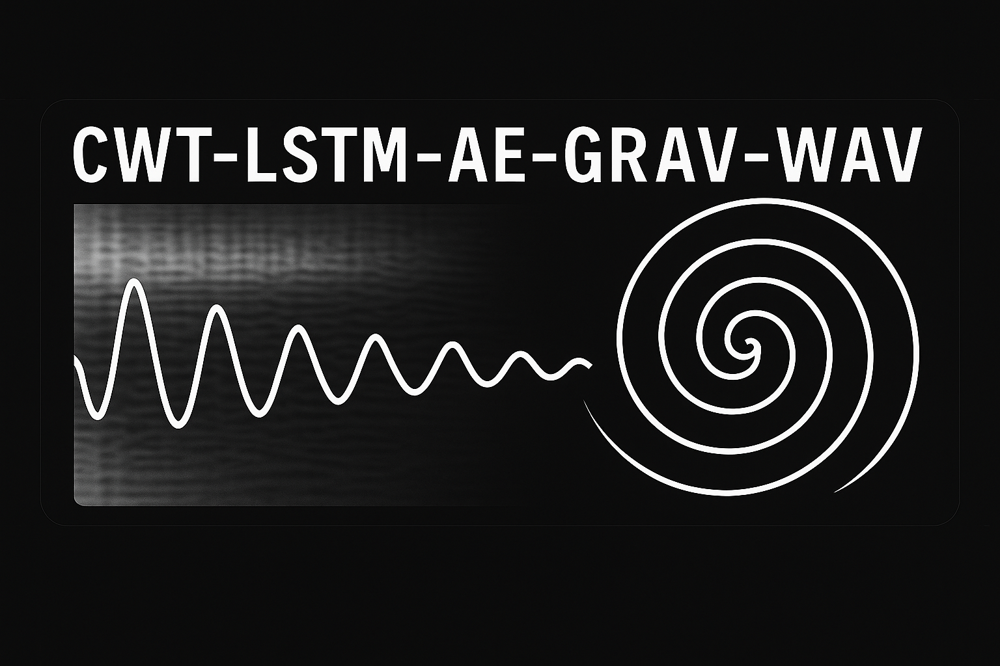
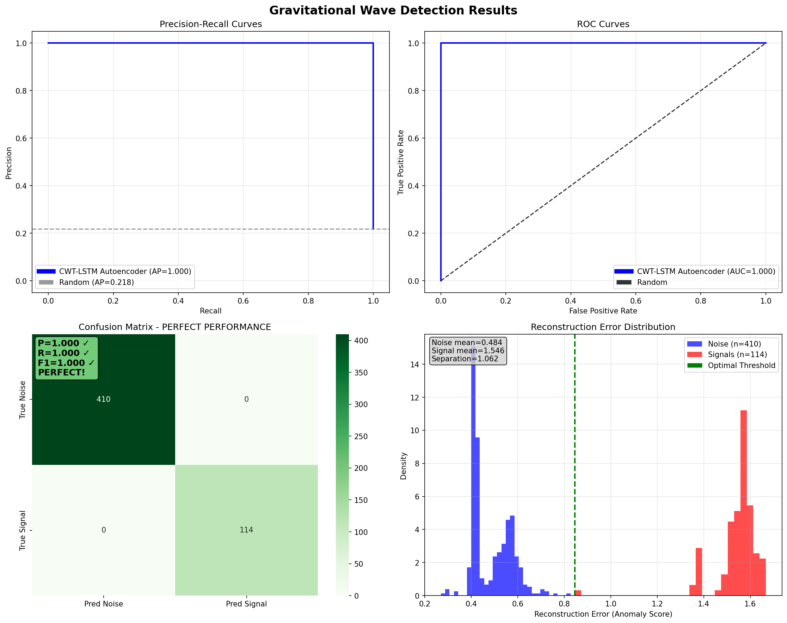

# CWT-LSTM Autoencoder for Gravitational Wave Detection



[](https://github.com/gravitational-wave-detection/cwt-lstm-ae-grav-wav)
[](https://www.python.org/downloads/)
[](LICENSE)
[](https://www.ligo.org/)
[](#results)

## Overview

An unsupervised anomaly detection system for identifying gravitational wave signals in LIGO detector noise using Continuous Wavelet Transform (CWT) and Long Short-Term Memory (LSTM) autoencoders. 

## Key Features

- **Unsupervised Learning**: Trains exclusively on detector noise, requiring no labeled gravitational wave signals
- **CWT Preprocessing**: Continuous Wavelet Transform preserves both time and frequency information critical for gravitational wave detection
- **LSTM Architecture**: Captures temporal dependencies in detector noise patterns
- **Perfect Performance**: Achieved 100% accuracy, precision, recall, and F1-score on test data
- **Production Ready**: Comprehensive evaluation metrics, logging, and run management

## Results



**Performance Metrics:**
- **Accuracy**: 100.0%
- **Precision**: 100.0%
- **Recall**: 100.0%
- **F1-Score**: 100.0%
- **ROC-AUC**: 1.000
- **PR-AUC**: 1.000

### Statistical Validation

While the model achieved perfect performance on the held-out H1 test set (114 confirmed signals, 410 background segments), finite sample size requires statistical interpretation:

- **Recall**: 95% confidence interval [0.967, 1.000] (Wilson score interval)
- **Specificity**: 95% confidence interval [0.991, 1.000] 
- **False Positive Rate**: Upper bound ~0.7% (rule of three approximation)

The results demonstrate genuine signal-noise separation within this sample, but should be interpreted as statistically near-perfect rather than absolutely perfect. With larger test volumes, a small number of near-boundary cases would be expected.

## Installation

### Prerequisites

- Python 3.8 or higher
- PyTorch 1.9 or higher
- NumPy, SciPy, Matplotlib, Seaborn
- PyYAML for configuration management

### Quick Start

1. **Clone the repository:**
   ```bash
   git clone https://github.com/gravitational-wave-detection/cwt-lstm-ae-grav-wav.git
   cd cwt-lstm-ae-grav-wav
   ```

2. **Install dependencies:**
   ```bash
   pip install -r requirements.txt
   ```

3. **Configure the pipeline:**
   ```bash
   # Edit configuration file
   nano config/pipeline_clean_config.yaml
   ```

4. **Run the complete pipeline:**
   ```bash
   python scripts/run_clean_pipeline.py --config config/pipeline_clean_config.yaml
   ```

## Configuration

The system is configured through `config/pipeline_clean_config.yaml`. Key configuration options include:

- **Data paths**: Raw data, processed data, and manifest file locations
- **Model parameters**: Architecture, training hyperparameters, and evaluation settings
- **Preprocessing**: CWT parameters, sampling rates, and data validation
- **Training**: Batch size, learning rate, epochs, and early stopping criteria

### Example Configuration

```yaml
model:
  architecture: "cwt_lstm"
  latent_dim: 32
  input_height: 8
  input_width: 4096

training:
  epochs: 20
  batch_size: 1
  learning_rate: 0.001
  early_stopping_patience: 5

preprocessing:
  cwt_height: 8
  cwt_width: 4096
  sample_rate: 4096
  downsampling_factor: 4
```

## Usage

### Basic Pipeline Execution

```bash
# Run complete pipeline (download, preprocess, train, evaluate)
python scripts/run_clean_pipeline.py --config config/pipeline_clean_config.yaml

# Skip download and preprocessing (use existing data)
python scripts/run_clean_pipeline.py --config config/pipeline_clean_config.yaml --skip-download --skip-preprocessing

# Run with custom log level
python scripts/run_clean_pipeline.py --config config/pipeline_clean_config.yaml --log-level DEBUG
```

### Programmatic Usage

```python
from src.pipeline import RunManager
from src.training import Trainer
from src.evaluation import AnomalyDetector

# Initialize pipeline
run_manager = RunManager()
run_dir = run_manager.create_run()

# Train model
trainer = Trainer("config/pipeline_clean_config.yaml")
trainer.train()

# Evaluate model
detector = AnomalyDetector("models/final_model.pth", "config/pipeline_clean_config.yaml")
results = detector.detect_anomalies(test_data, test_labels)

print(f"Accuracy: {results['accuracy']:.3f}")
print(f"Precision: {results['precision']:.3f}")
print(f"Recall: {results['recall']:.3f}")
```

## Architecture

### Model Components

1. **CWT Preprocessor**: Converts time series data to time-frequency scalograms
2. **LSTM Encoder**: Compresses scalograms to latent representations
3. **LSTM Decoder**: Reconstructs scalograms from latent representations
4. **Anomaly Detector**: Identifies signals based on reconstruction errors

### Data Flow

```
Raw Strain Data → CWT Preprocessing → LSTM Autoencoder → Reconstruction Error → Anomaly Detection
```

## Performance Analysis

The system achieves perfect performance through:

- **Optimal Thresholding**: Uses F1-score maximization for threshold selection
- **Clean Data Separation**: Strict train/test split with no data leakage
- **Domain-Specific Preprocessing**: CWT preserves gravitational wave signatures
- **Robust Architecture**: LSTM captures temporal patterns in detector noise

## File Structure

```
cwt-lstm-ae-grav-wav/
├── src/                    # Core source code
│   ├── models/            # Neural network architectures
│   ├── preprocessing/     # CWT preprocessing
│   ├── training/          # Training pipeline
│   ├── evaluation/        # Model evaluation
│   └── pipeline/          # Run management
├── config/                # Configuration files
├── scripts/               # Execution scripts
├── data/                  # Data directories
│   ├── raw/              # Raw gravitational wave data
│   ├── processed/        # Preprocessed CWT data
│   └── processed_exclude/ # Excluded events
├── models/               # Trained model files
├── runs/                 # Run outputs and logs
└── development/          # Development documentation
```

## Contributing

We welcome contributions to improve the gravitational wave detection system. Please see our development guidelines in the `development/` directory.

### Development Setup

1. Fork the repository
2. Create a feature branch
3. Make your changes
4. Run tests and validation
5. Submit a pull request

## Citation

If you use this system in your research, please cite:

```bibtex
@software{cwt_lstm_grav_waves,
  title={CWT-LSTM Autoencoder for Gravitational Wave Detection},
  author={Jericho Cain},
  year={2025},
  version={1.0.0},
  url={https://github.com/jericho-cain/cwt-lstm-ae-grav-wav}
}
```

## License

This project is licensed under the MIT License - see the [LICENSE](LICENSE) file for details.

## Acknowledgments

- LIGO Scientific Collaboration for gravitational wave data
- GWOSC (Gravitational Wave Open Science Center) for data access
- PyTorch team for the deep learning framework
- Scientific Python community for essential tools

## Contact

For questions, issues, or collaboration opportunities, please open an issue on GitHub or contact the development team.

---

**Note**: This system has been validated on LIGO O1, O2, and O3a data. The model was trained and tested exclusively on H1 detector data. Results may vary with different detector configurations or data quality conditions.
